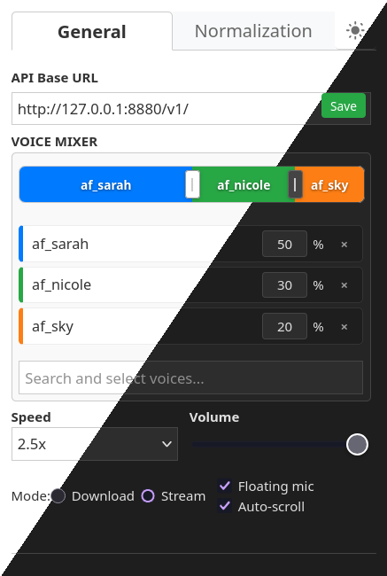
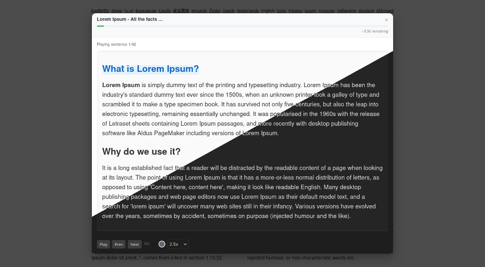
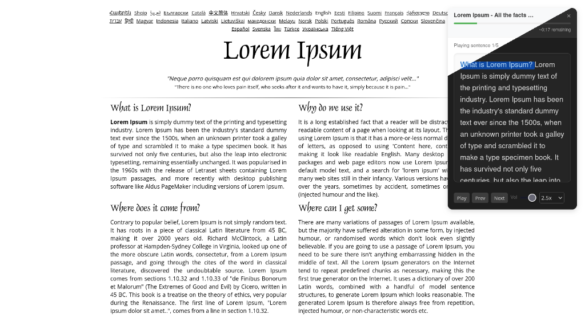

# Kokoro TTS Extension

Browser extension (**Chrome** & **Firefox**) that sends selected text or full articles to a [Kokoro-FastAPI](https://github.com/remsky/Kokoro-FastAPI) endpoint for high-quality text-to-speech. Supports streaming playback in the page overlay or downloading the generated audio file, plus an EPUB reader mode.

<p align="center">
  <a href="https://chromewebstore.google.com/detail/kokoro-tts-sender/befhghjhbjpjnbamdginljoiaafoclmf">
    
  </a>
  <a href="https://addons.mozilla.org/en-US/firefox/addon/kokoro-tts-sender/">
    
  </a>
</p>

## Showcase

### Settings & voice mixer

Configure the API endpoint, mix voices with weights, and control speed/volume from the popup.

<p align="center">
  
</p>

### Overlay experience

Read highlighted text or a whole article with an in-page overlay and playback controls.

<p align="center">
  
</p>

<p align="center">
  
</p>

## Features

Verified against the current source (not aspirational):

- **Kokoro-FastAPI TTS** — speech generation via the OpenAI-compatible `/v1/audio/speech` API on a **user-configured** endpoint (default `http://127.0.0.1:8880/v1/`; localhost, LAN, or remote).
- **Chrome & Firefox (MV3)** — separate builds under `dist/chrome` and `dist/firefox`.
- **Selection or whole article** — context menus “Send to Kokoro TTS” (selection) and “Read Article with Kokoro TTS” (Readability-based article extract).
- **Stream or download** — stream audio into the overlay player, or download a file.
- **Voice mixer** — search voices from the API and blend multiple voices with weights.
- **Text normalization** (toggleable) — contractions, transliteration of non-Latin scripts, dates/numbers, units, URLs, emails, phones, and related pronunciation prep in `text-processor.js`.
- **Overlay playback** — play/pause/stop, speed & volume, Spacebar play/pause; optional auto-scroll on the origin page with a “comfort zone” to reduce jumpiness.
- **Floating mic button** — optional on-page control (can be disabled in settings).
- **EPUB reader** — open documents in `reader.html` (epub.js); optional autoplay.
- **Themes** — light/dark toggle in the popup.
- **Keyboard shortcuts** — e.g. read article, next/previous sentence, close overlay; EPUB open shortcut is suggested on Firefox (Chrome has a tighter default-shortcut limit).
- **Connection status icon** — toolbar icon reflects API reachability.

## Privacy & data handling

- The extension does **not** hardcode a vendor cloud TTS API. Text you select or extract is sent to the **Kokoro-FastAPI base URL you configure** in settings.
- That endpoint may be **localhost**, another machine on your **LAN**, or a **remote** host you choose. If you point it at a remote server, text leaves your browser over the network to that server.
- Settings (API URL, voices, playback options, etc.) are stored in the browser’s extension storage.
- There is **no** built-in telemetry or analytics in this extension.
- See [`PrivacyPolicy.md`](./PrivacyPolicy.md) for the store-facing policy text.

Default host permissions cover localhost; non-local URLs prompt for optional host permission at runtime.

## Prerequisites

- **Node.js >= 20** and npm (for building from source).
- A reachable **[Kokoro-FastAPI](https://github.com/remsky/Kokoro-FastAPI)** instance (local Docker, LAN, or remote) for actual speech generation. Unit tests mock the API and do **not** require a live server.

## Installation & build

```bash
git clone https://github.com/Fooftilly/kokoro-extension.git
cd kokoro-extension
npm ci
npm run build
```

This creates:

- `dist/chrome` — unpacked Chrome extension
- `dist/firefox` — unpacked Firefox extension

Other commands:

| Command | Purpose |
| --- | --- |
| `npm test` | Jest unit tests |
| `npm run lint` | ESLint |
| `npm run package` | Build + zip packages for store upload |

`package.json` `version` is the single source of truth for extension manifests and package filenames.

## Loading the extension

### Google Chrome

1. Open `chrome://extensions/`.
2. Enable **Developer mode**.
3. **Load unpacked** → select `dist/chrome`.

### Mozilla Firefox

1. Open `about:debugging#/runtime/this-firefox`.
2. **Load Temporary Add-on…**
3. Select `dist/firefox/manifest.json`.

## Usage

1. Configure the API base URL in the popup (default `http://127.0.0.1:8880/v1/`) and ensure Kokoro-FastAPI is reachable.
2. **Highlighted text:** select text → right-click → **Send to Kokoro TTS**.
3. **Whole article:** right-click the page → **Read Article with Kokoro TTS** (or use the read-article shortcut).
4. Choose **Stream** or **Download** in settings; adjust voice mixer, speed, volume, and normalization as needed.
5. Optional: open the EPUB reader from the popup or the configured shortcut.

## Development

- Architecture, agent rules, and regression expectations: [`AGENTS.md`](./AGENTS.md)
- Contributing guide: [`CONTRIBUTING.md`](./CONTRIBUTING.md)
- Cursor Project worker workflow: [`docs/agent-workflows/cursor-projects.md`](./docs/agent-workflows/cursor-projects.md)
- Security reporting: [`SECURITY.md`](./SECURITY.md)

Before opening a PR: `npm ci`, targeted tests as needed, `npm test`, `npm run lint`, `npm run build`. Do not edit `dist/` by hand.

## Credits

- **Kokoro TTS** via [Kokoro-FastAPI](https://github.com/remsky/Kokoro-FastAPI)
- [Compromise](https://github.com/spencermountain/compromise) (+ dates/numbers) for text normalization
- [Transliteration](https://github.com/yf-hk/transliteration) (lite bundle in-repo) for script conversion
- [WebExtension Polyfill](https://github.com/mozilla/webextension-polyfill)
- [Readability](https://github.com/mozilla/readability) for article extraction
- [DOMPurify](https://github.com/cure53/DOMPurify), [epub.js](https://github.com/futurepress/epub.js), [JSZip](https://github.com/Stuk/jszip)

## License

[MIT](./LICENSE) © Nikola Perović
